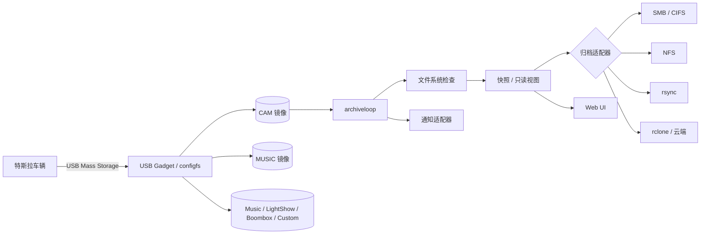

# TeslaUSB 核心架构

## 1. 设计目标

TeslaUSB 同时扮演两个角色：对车辆是一块普通 USB 存储设备；对家庭网络是一台能检查、整理和归档录像的 Linux 主机。核心难点不是复制文件，而是在“车辆正在写盘”和“Linux 正在读盘”之间建立严格互斥。



## 2. 分层

| 层 | 主要目录 | 责任 |
| --- | --- | --- |
| 镜像构建 | `pi-gen-sources/` | 基于 Bookworm 生成 ARMHF 系统、安装依赖、注入服务 |
| 首次启动 | `setup/` | 读取用户配置、创建分区/镜像、配置网络与 systemd |
| 设备运行时 | `run/` | USB Gadget、热点、温度、录像清理和服务脚本 |
| 归档 | `archive/` | CIFS、NFS、rsync、rclone 连接与复制策略 |
| 通知 | `setup/pi/notify/` | 将统一事件发送到不同消息渠道 |
| 展示 | Web UI / `site/` | 设备内录像浏览与项目能力介绍；两者相互独立 |

## 3. 存储模型

系统把职责拆成三类空间：

- 根文件系统：默认只读，保存系统与脚本，减少突然断电造成的损坏；
- `/mutable`：保存日志、状态和运行时配置；
- backing files / 数据盘：承载暴露给车辆的 FAT/exFAT 虚拟磁盘。

车辆只能看到 USB LUN，不直接看到 Linux 根文件系统和归档端。外接 `DATA_DRIVE` 可承载大容量 backing files，但首次配置可能重建其分区表。

## 4. USB Gadget 生命周期

`run/enable_gadget.sh` 使用 configfs 创建 USB Mass Storage Gadget，并把启用的 CAM、MUSIC、LIGHTSHOW、BOOMBOX、CUSTOM backing file 绑定为 LUN。`CUSTOM` 盘预建 `Wraps/`，用于车身贴图等自定义素材。归档前必须先解除 UDC 绑定，让车辆停止访问磁盘；归档完成后再重新连接。

```mermaid
sequenceDiagram
  participant Car as 车辆
  participant Gadget as USB Gadget
  participant Loop as archiveloop
  participant Archive as NAS/云端
  Car->>Gadget: 写入录像
  Loop->>Gadget: 请求安全断开
  Gadget-->>Car: USB 存储离线
  Loop->>Loop: fsck、挂载、创建稳定视图
  Loop->>Archive: 复制新增录像
  Archive-->>Loop: 成功确认
  Loop->>Loop: 清理已归档文件、同步音乐
  Loop->>Gadget: 重新绑定 LUN
  Gadget-->>Car: USB 存储恢复
```

关键不变量：

1. 车辆写入期间，Linux 不以可写方式同时挂载同一文件系统；
2. 只有归档端确认成功后才允许清理源文件；
3. 任一步骤失败时保留源录像，并通过日志/通知暴露错误；
4. 无论归档成功与否，都要尽力恢复车辆可见的 USB 设备。

## 5. 归档与空间管理

`archiveloop` 周期性判断网络和车辆状态，随后调用选定的后端适配器。CIFS/NFS 负责远端挂载，rsync 负责增量传输，rclone 面向对象存储或云盘。`ARCHIVE_SYSTEM=none` 时不外传，只保留本地和 Web UI 能力。

空间管理器按可用容量和保留策略处理 `SavedClips`、`SentryClips`、`RecentClips`。RecentClips 扩展保留是 TeslaUSB 的能力，不代表无限保存；容量阈值仍优先保证车辆继续写入。

## 6. Web 与通知

设备内 Web UI 由 Nginx、fcgiwrap 和固定版本的 `teslausb-webui` 组成，可通过 FUSE 视图访问多摄像头录像。发布包在构建时校验并缓存，首次访问默认简体中文。Basic Auth 可降低局域网误访问风险，但不应直接暴露公网。

通知层采用统一事件入口，再转发到钉钉、企业微信、飞书、Signal、Pushover、Gotify、IFTTT、Discord、AWS SNS、Telegram、Webhook、Slack、Matrix、ntfy 或自定义 shell。国内机器人请求由标准库实现 UTF-8 JSON 编码，并支持钉钉/飞书签名。密钥只应存在设备配置，不应进入镜像源码或版本库。

## 7. 网络与唤醒

首次配置可启动临时 Wi‑Fi AP；日常运行连接家庭 Wi‑Fi。保持车辆唤醒可选择 TeslaFi、Tessie、BLE 或 Webhook 等一种方式，避免同时启用多个策略造成重复请求或额外耗电。

## 8. 故障定位入口

| 现象 | 首查位置 |
| --- | --- |
| 首次启动失败 | `/mutable/teslausb-headless-setup.log` |
| 车辆看不到磁盘 | `run/enable_gadget.sh`、UDC/configfs、数据线与 OTG 口 |
| 无法归档 | 网络、归档后端挂载、`archiveloop` 日志和通知 |
| Web UI 空白 | backing file 挂载、FUSE 视图、Nginx/fcgiwrap |
| 频繁损坏 | 供电、文件系统检查结果、是否在写入时异常断电 |

## 9. 演进原则

- 上游跟踪分支不混入本地化提交；
- 构建源、镜像源和产物校验值应可追溯；
- 本地化不得修改协议字段、路径和配置变量名；
- 影响 USB 互斥或清理策略的改动必须用失败路径验证，而不只验证成功路径。
